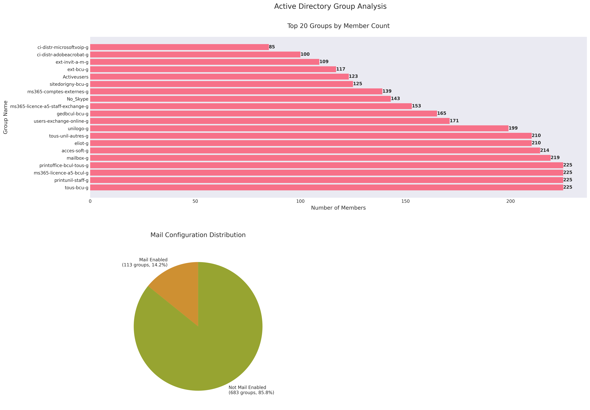

# Active Directory Group Analysis Tool

## Overview
This tool analyzes Active Directory groups and their memberships, providing detailed information about group configurations, types, and member relationships.

## Reports
- [Detailed Group Analysis](./group_analysis.md) - Full analysis of each group and its members
- [Visual Analysis](./group_analysis.png) - Visual representation of group statistics

## Property Explanations

### Group Properties
- **distinguishedName**: The unique LDAP path that identifies where the object is located in the directory
- **mailEnabled**: Whether the group can receive emails
- **hiddenFromGAL**: Whether the group is hidden from the Global Address List
- **memberCount**: Number of members in the group (including nested group members)

### Recipient Types
Each group has a specific recipient type that defines its behavior in Exchange:

- `0x0`: Regular Mailbox
- `0x1`: GAL Only User
- `0x6`: Mail Contact
- `0x7`: Mail User
- `0x40000000`: Universal Security Group
- `0x7fffff00`: Universal Distribution Group
- `-0x7ffffffa`: Non-Universal Security Group
- `-0x7ffffefe`: Non-Universal Distribution Group

## Statistics
Total number of analyzed groups: 796
- Mail-enabled groups: 113
- Groups hidden from GAL: 1

## Understanding Group Types
The tool analyzes several aspects of each group:

### Mail Configuration
- **Mail-Enabled**: Groups that can receive email
- **Not Mail-Enabled**: Groups used for permissions only

### Visibility
- **Hidden from GAL**: Not visible in the Global Address List
- **Visible**: Appears in address lists and GAL

## Report Structure
The detailed report ([group_analysis.md](./group_analysis.md)) contains:
1. Overall summary of analyzed groups
2. Detailed information for each group:
- Basic properties
- Configuration settings
- Complete member list
